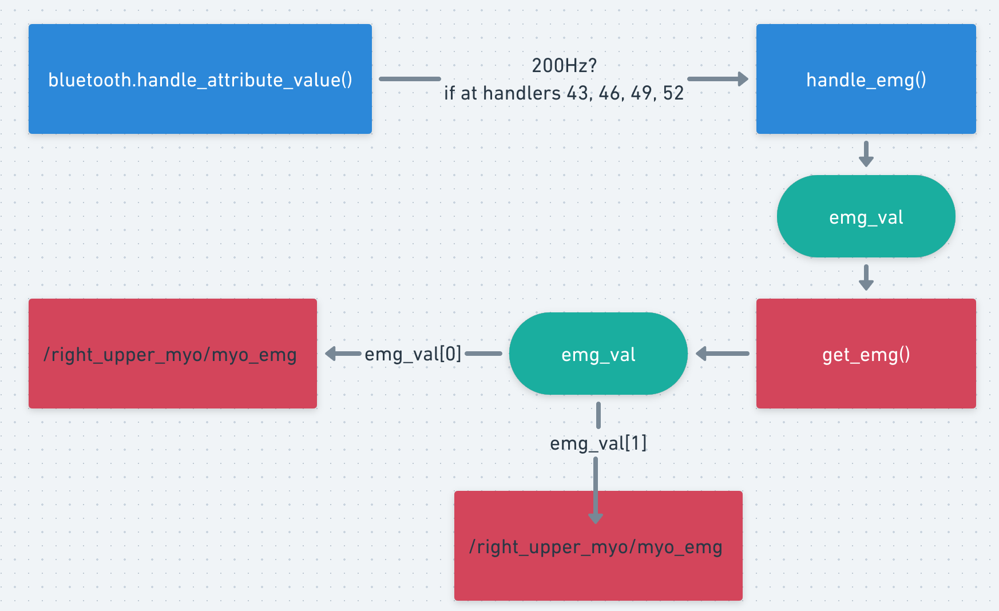
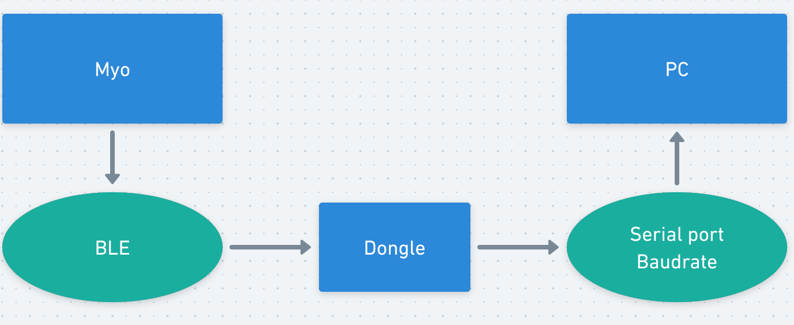

# Debug EMG Data Transfer Rate

#### In Ros node: (adjust Ros rate or baudrate)



For two Myos one dongle,  the two Myos will publish two EMG data together through serial port, but each EMG data will be published by separate Ros topic, the test is based on the individual of each EMG data.

Set the condition for publish EMG data only when its value (getting from myo) changes:

```
if (self.last_emg is None \ or 
	(not self.last_emg[0] == self.emg_val[0] and 
	not self.last_emg[1] == self.emg_val[1])) \
	and self.emg_val is not None:
```

By then, only get EMG topic published by Ros node limited at **85 Hz** even set very high rate in ROS

Change baudrate from 1200 to 115200 does impact the emg data rate (theoretically should matter but maybe the transfered data is compressed)

So narrow down the issue (EMG data not reaches 200Hz) to the Myo device driver end 

#### In Myo driver: (adjust baudrate)

the process how EMG data transfer from Myo device to PC:



The timer I set in order to measure the EMG data publish rate is inside the handle_emg() function, so that it can reflect the frequency that bluetooth event handler (handle_attribute_value)  sends the EMG data (emg_val) 

##### Test serial port baudrate:

​	For one Myo one Dongle: 130 Hz, baudrate will not affect

​	For two Myo one Dongle: 260 Hz, baudrate will not affect


Discussion:

1. in Ros node, is better to publish the EMG topic when the EMG data from two myos different or just one of them different?  even the rate pub by two myo at 2600 Hz does not match Ros pub rate at 85Hz
2. Is it the right way to change the baudrate?
3. it is a way to adjust the handler trigger freq or myo emg data pub freq?

