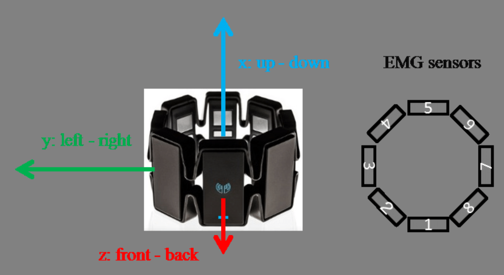
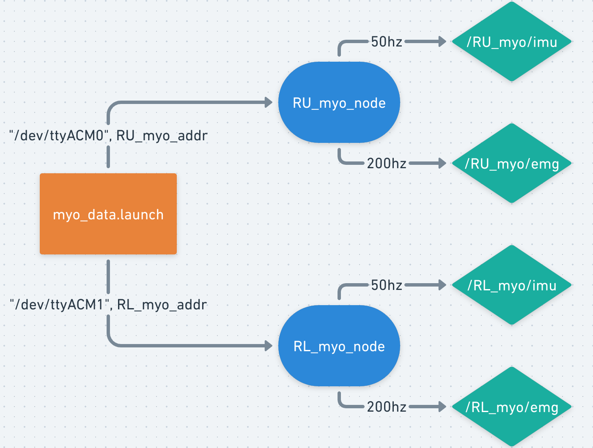

# Pipeline for recording EMG/IMU

### Record data (right arm example)

1. **Launch corresponding nodes and published EMG/IMU topics:**

   `roslaunch connect_myo myo_data.launch` 

2. **Record corresponding topics in xxx.bag file:**

   `rosbag record -O [xxx.bag] /RU_myo/emg /RU_myo/imu /RL_myo/emg /RL_myo/imu`

3. **Convert bag to csv file:**

   `rosrun rosbag_to_csv rosbag_to_csv.py`

### Data Streaming flow

